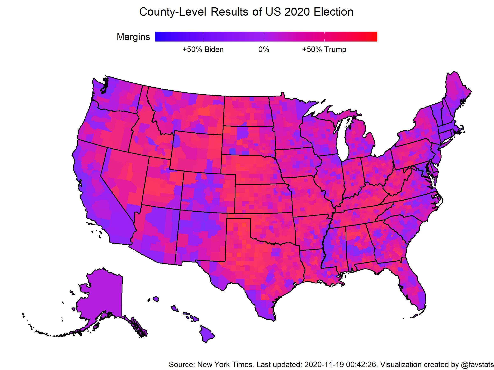

### NOTE: this data does NOT represent the official vote count and may differ from it.

This repository provides access to Edison Research election results data on the county level, scraped from the New York Times. 

Check the `data/latest` folder and retrieve the csv file you want. Note: after every iteration this file will be overwritten.

## Some fun with graphs

